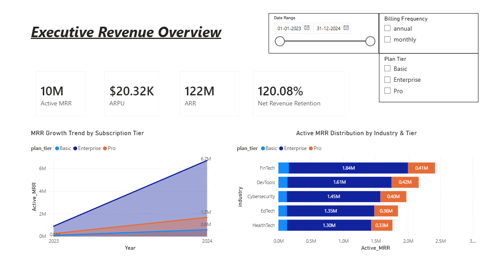
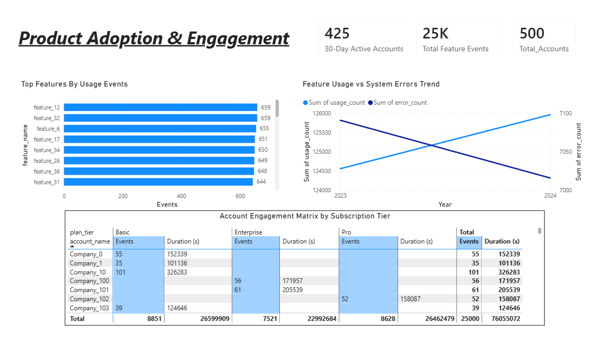
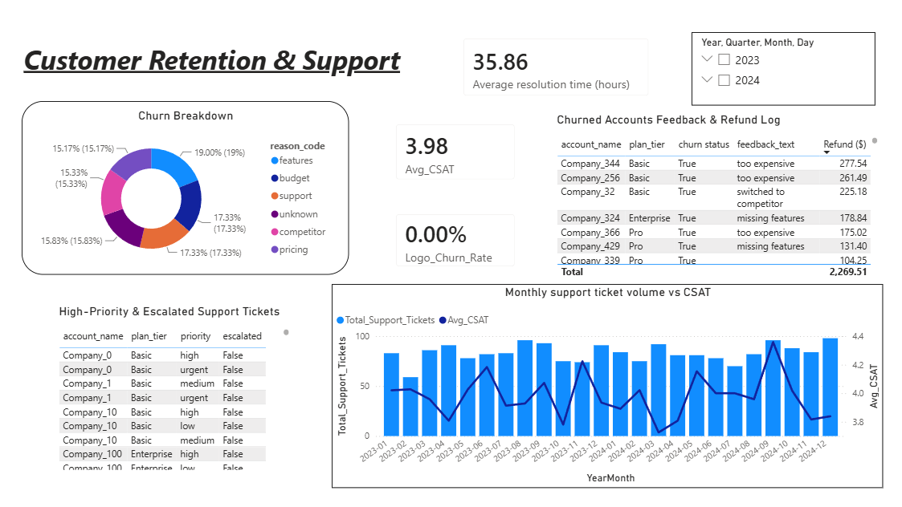

# RavenStack: B2B SaaS Business, Product & Retention Intelligence Dashboard

## 📌 Executive Summary
An end-to-end Power BI analytics project designed to evaluate recurring revenue health, feature adoption velocity, and customer retention dynamics for a B2B SaaS platform. This project unifies multi-source operational data into a single star-schema data model, enabling cross-functional decision-making for Product, Revenue, and Growth teams.

---

## 📊 Dashboard Overview

### Page 1: Executive Revenue Overview
Focuses on predictable top-line revenue growth, tier expansion, and customer value performance.


* **Key Insights:** Tracks **Active MRR ($10M+)**, Annual Recurring Revenue (ARR), Average Revenue Per User (ARPU), and Net Revenue Retention (NRR).
* **Strategic Value:** Enables executives to pinpoint high-performing revenue verticals (e.g., FinTech, DevTools) and monitor tier upgrade trajectories over time.

---

### Page 2: Product Adoption & Engagement
Evaluates feature stickiness, account activity levels, and potential product drop-offs.


* **Key Insights:** Monitors **30-Day Active Accounts (425)**, feature event counts, and system error rates.
* **Strategic Value:** Helps Product Managers identify core "Aha!" modules versus underutilized features, linking engagement duration to specific plan tiers.

---

### Page 3: Customer Retention & Support Health
Analyzes churn drivers, customer support SLAs, and account risk indicators.


* **Key Insights:** Tracks Logo Churn Rate, Average CSAT (3.98/5), resolution turnaround times, and qualitative cancellation reasons.
* **Strategic Value:** Uncovers correlations between support ticket spikes and CSAT drops, empowering retention teams to target high-priority escalated accounts before churn occurs.

---

## 🛠️ Data Model & DAX Logic

### Star Schema Architecture
* **Dimension Tables:** `accounts`, `Dim_Date`
* **Fact Tables:** `subscriptions`, `feature_usage`, `support_tickets`, `churn_events`

### Core DAX Measures

```dax
// Active Monthly Recurring Revenue (MRR)
Active_MRR = 
VAR MaxDate = MAX(Dim_Date[Date])
RETURN
CALCULATE(
    SUM(subscriptions[mrr_amount]),
    subscriptions[start_date] <= MaxDate,
    ISBLANK(subscriptions[end_date]) || subscriptions[end_date] > MaxDate
)

// Net Revenue Retention (NRR)
NRR = 
VAR MaxDate = MAX(Dim_Date[Date])
VAR EndOfPrevMonth = EOMONTH(MaxDate, -1)
VAR StartingMRR = 
    CALCULATE(
        [Active_MRR],
        REMOVEFILTERS(Dim_Date),
        Dim_Date[Date] = EndOfPrevMonth
    )
VAR EndingMRR = [Active_MRR]
RETURN DIVIDE(EndingMRR, StartingMRR, 0)

// 30-Day Active Users (Product Stickiness)
Active_Users_30D = 
CALCULATE(
    DISTINCTCOUNT(feature_usage[account_id]),
    DATESINPERIOD(Dim_Date[Date], MAX(Dim_Date[Date]), -30, DAY)
)
